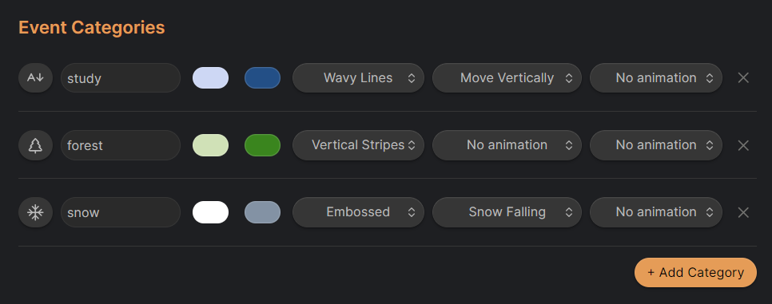
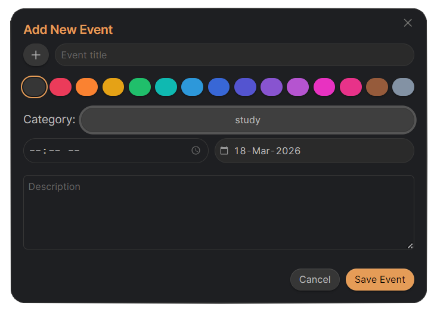
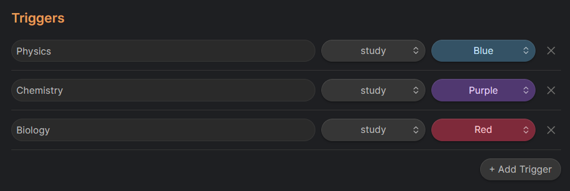
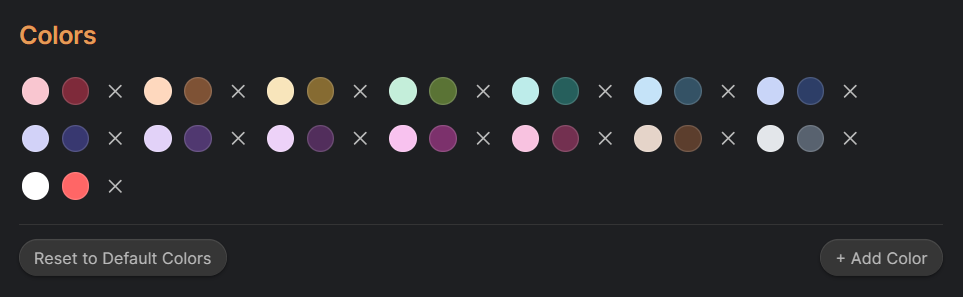
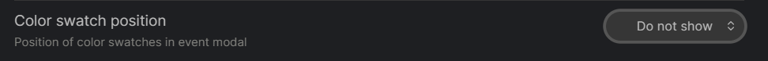
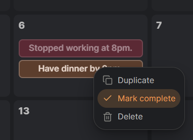
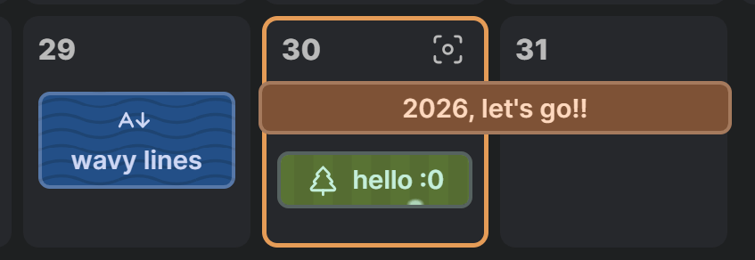
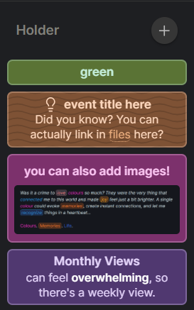
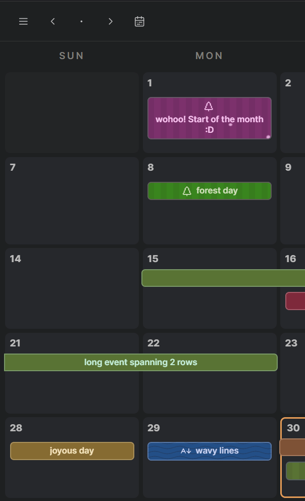

# Dayble Calendar
A fast calendar for Obsidian that stores events as monthly JSON files directly inside your vault. Fully customizable with colors, effects, and animations.

Dayble Calendar is non-intrusive. Events never appear in daily notes, keeping your notes clean. You can attach Markdown links to events to quickly jump to related notes.

This plugin is based on a customizable calendar I originally built as a [website](https://kazi-aidah.github.io/Aidah-s-Calendar/), rebuilt to work directly inside Obsidian!

## Event Categories
Style a Category once using colors, effects and animations 

and assign events with the Category Styling right from the Add Event Modal!

or even assign triggers, what text will trigger what category & what color.

## Colors
Add your own colors, events using Category Styling can use user-selected colors.

Note: You can drag to reorder the colors.

Or hide the color swatches from the Add Event Modal and completely rely on the Category Styling.

## Event Behaviour
Dim or Hide events you marked as complete to declutter your calendar.

Enable "Only animate today's events" if all the animations on events feel overwhelming.

Use markdown, html & image embeds inside an event to know the event at a glance.

## Holder
Dayble Calendar has a holder on the left by default to hold events without a date in.

## Installation
This plugin is currently not available in Obsidian Community Plugins so you'll have to do a manual installation.

1. Download the `main.js`, `styles.css` and `manifest.json` files from [Releases](https://github.com/Kazi-Aidah/dayble-calendar/releases).

2. In your `vault/.obsidian/plugins/` folder path, create a new folder named "dayble-calendar" 

3. and just bring the downloaded files here. 

Close and reopen Obsidian or reload the plugins from Obsidian Community Plugins tab and you should find the Dayble Calendar plugin appear in the **Installed Plugins** list.

## Feedback or Feature Request
Found any bugs or want new features? Create an issue [here](https://github.com/Kazi-Aidah/dayble-calendar/issues/new)!