# Dayble Calendar
A fast, customizable calendar for Obsidian that stores events as monthly JSON files directly inside your vault. Fully tweakable with colors, effects, and animations.

|  | 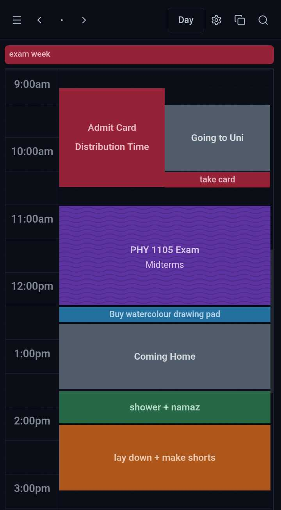 |
|------------------------|----------------------------|


Dayble Calendar is non-intrusive. Events never appear in daily notes, so your notes stay clean. You can attach Markdown links to events and jump straight to related notes.

This plugin is based on a customizable calendar I originally built as a [website](https://kazi-aidah.github.io/Aidah-s-Calendar/), now rebuilt to live directly inside Obsidian.


## Event Categories
Style a Category once with colors, effects, and animations,

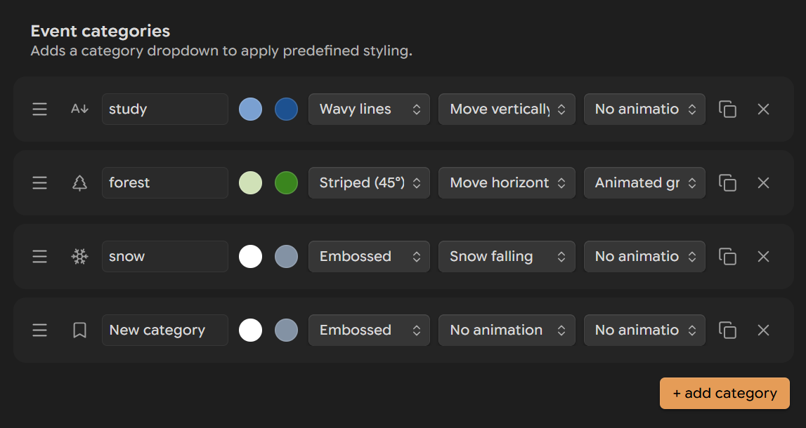

then assign that styling to events right from the same modal.

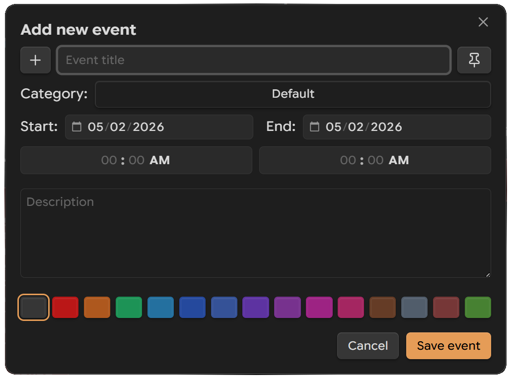


## Triggers
Create triggers that match text in an event’s title or description. Triggers can automatically apply an Event Category and Event Color (from your custom color groups).


## States
States let you add icons and labels that appear in the context menu as “Set as [state]”. Each state can also define its own Event Color, effects, and animations.


## Colors
Add your own colors. Events using Category Styling can use your custom palette.

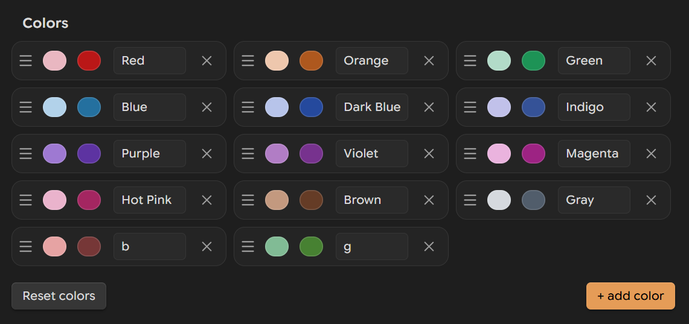

You can drag to reorder colors.

Or hide the color swatches in the Add Event modal and rely entirely on Category Styling.

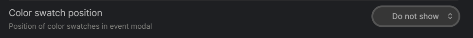


## Completed Event Display
When an event is marked complete, you can choose what happens:
- Nothing  
- Dim  
- Hide  
- Strikethrough  
- Change Color  

You can also set a default event color (for example: red for todo, green for complete).

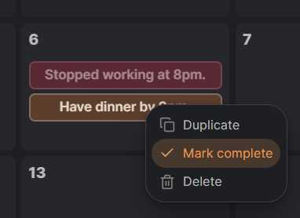


## Event Behavior
If animations feel overwhelming, enable “Only animate today’s events”.

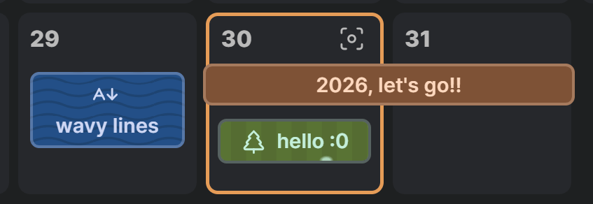

You can use Markdown, HTML, and image embeds inside an event to recognize it at a glance.

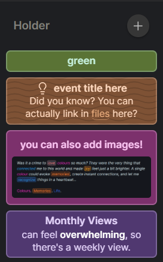


## Show Only Pinned Events
In Month, Week, and Agenda views, you can choose to show only pinned events.  
3 Day and Day views don’t include this option since they focus on specific time blocks.


## View Modes

### Month View
Supports both normal and long events. When long events are stacked, the gaps between the stacking of events are not perfect but it is fully usable.

### Week View
Like Month view, but focused on a single week. You can enable “Weekly Notes” to add a small textarea for reminders or quick notes.

### 3 Day View
Shows a timetable-style layout with three columns. Use the `<>` buttons to move between dates for precise control. The current time label appears here, and you can dim past events from the Interface section in settings.

You can click on the day date to add an all day event, or just drag your normal events into the all day section.
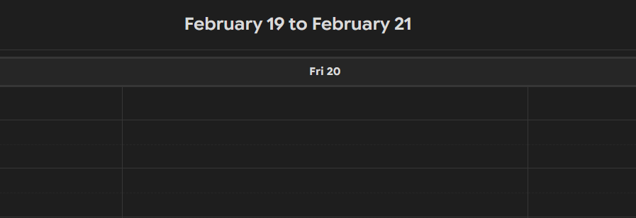

### Day View
A timetable for a single day. Day Split mode is great if you prefer separate morning and afternoon sections instead of one long scrollable column.

You can also select time period using the time column.
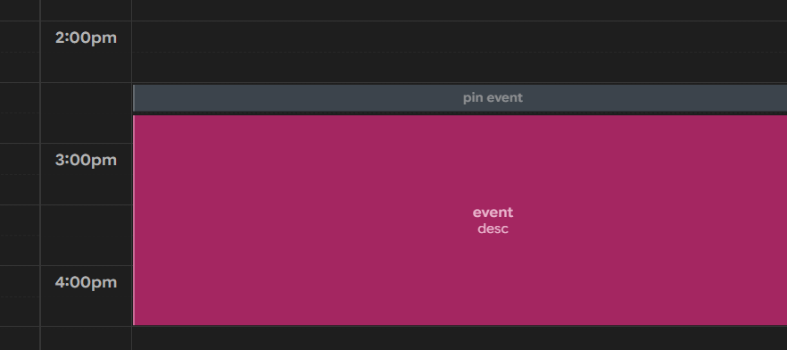

### Agenda View
Displays events in a list. If “Only show pinned events in Agenda view” is enabled, you’ll see just the important stuff, no clutter.

### Switching Between Views
Scroll on the Month/Week/3Day/Day/Agenda dropdown to quickly cycle between views.

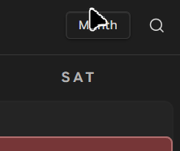


## Holder
Dayble Calendar includes a Holder on the left by default. It’s a space for events without a date.

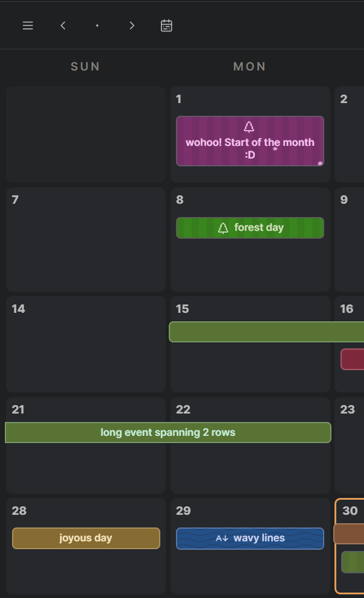


## Why “Dayble”?
**Day** + Ta**ble** = Dayble.

My original idea for this plugin was to have two panes in one tab: one showing the Day View with time blocks, and the other featuring today’s daily note.

While building it, I realized that setup wasn’t all that useful. So I brought my old (but very customizable) calendar concept here instead.


## Installation
Dayble Calendar isn’t available in the Obsidian Community Plugins yet, so you’ll need to install it manually.

1. Download `main.js`, `styles.css`, and `manifest.json` from Releases  
   https://github.com/Kazi-Aidah/dayble-calendar/releases

2. In your `VAULTNAME/.obsidian/plugins/` folder, create a new folder called `dayble-calendar`.

3. Place the downloaded files inside that folder.

Close and reopen Obsidian (or reload plugins from the Community Plugins tab). 
Dayble Calendar should now appear in your **Installed Plugins** list.


## Feedback or Feature Requests
Found a bug or want a new feature? Open an issue here:  
https://github.com/Kazi-Aidah/dayble-calendar/issues/new

---
## **Customization using CSS Snippets**
### Current Time Label
Use `.dayble-current-time-line` and `.dayble-current-time-label` for CSS Snippets to customize the current time indicator.

### None Event color blending issue
If the "None" event color blends into the background in Day View, you can change it by adding a CSS snippet:

```
:root {
    --dayble-focus-event-default-bg: darkgreen;
    --dayble-focus-event-default-text: yellow;
    --dayble-focus-event-default-border: orange;
}
```

### Hide "ALL DAY" text in 3 Day View
Use this:
```
.dayble-3day-all-day-spacer {
    display: none !important;
}
```